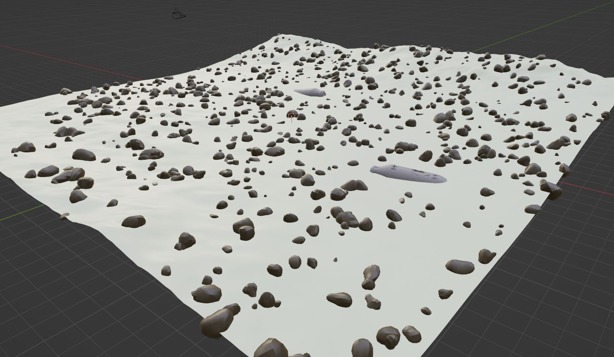
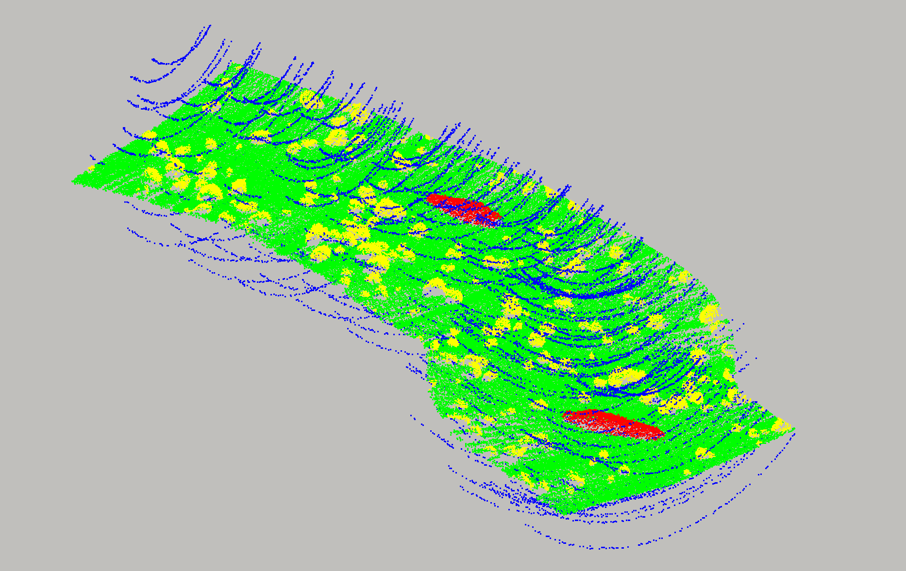
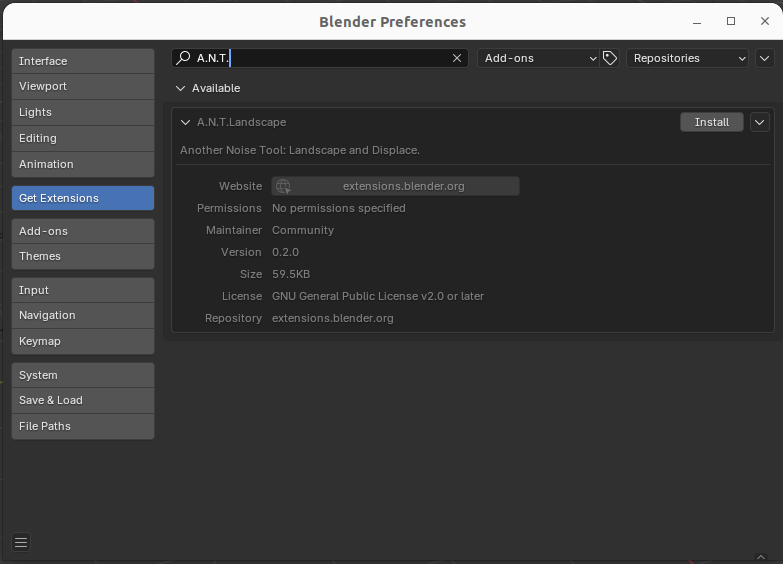

# BLENDgänger

BLENDgänger is a tool that enables the generation of virtual underwater scenes containing UXOs (unexploded ordnance). In addition, the BlAInder range scanner add-on is used to generate synthetic MBES bathymetry data of the scenes, along with ground truth labels (point labels and bounding box information of UXOs). Such data may be used to train models for UXO perception tasks.

<div align="center">
  
  <p><em>Figure 1: Generated underwater scene with UXOs and seafloor terrain</em></p>
</div>

<div align="center">
  
  <p><em>Figure 2: Synthetic MBES bathymetry data with ground truth annotations</em></p>
</div>

## Features

- **Procedural underwater scene generation** with configurable landscapes
- **Realistic sensor trajectory simulation** with customizable trajectories (bends, pertubations, etc...)
- **Munition object placement** with multiple types (500lbs, artillery shells, mines, etc.), based on real scans of UXO objects
- **Boulder and marine snow particle generation** for realistic seafloor environments
- **Synthetic sonar data generation** with configurable noise and interference
- **Headless and GUI operation modes** for different use cases
- **YAML-based configuration** for easy parameter adjustment
- **Multiple export formats** (.dae, .csv, bounding box annotations)

## Table of Contents
- [Installation](#installation)
  - [Blender](#blender)
  - [BLENDgänger](#blendgänger)
  - [BlAInder](#blainder)
  - [Additional Setup](#additional-setup)
- [Usage](#usage)
  - [In Blender (GUI Mode)](#in-blender-gui-mode)
  - [Headless Mode](#headless-mode)
  - [Autoplay Mode](#autoplay-mode)
- [Configuration](#configuration)
- [License](#license)

## Installation

### Blender

This has been tested with Blender 4.2 LTS. Use the following command to download Blender 4.2 and to uncompress it.

```
wget https://mirrors.de.sahilister.net/blender/release/Blender4.2/blender-4.2.4-linux-x64.tar.xz
tar -xf blender-4.2.4-linux-x64.tar.xz
```

Install any additional python libraries using Blender's python:

```
./blender-4.2.4-linux-x64/4.2/python/bin/python3.11 -m ensurepip
./blender-4.2.4-linux-x64/4.2/python/bin/python3.11 -m pip install pyproj matplotlib pandas scipy h5py fake-bpy-module
```

### BLENDgänger

Clone this repository to a location of your choice. In the following examples, replace `<BLENDGAENGER_PATH>` with the actual path to your cloned repository.


### BlAInder

BLENDgänger requires a custom version of the BlAInder `range_scanner` addon to be installed. Follow the installation instructions located [here](https://github.com/AmosSmith3/blainder-range-scanner).

The original version of BlAInder may be found at https://github.com/ln-12/blainder-range-scanner.

Please refer to the original BlAInder repository for more details on its licensing, usage, issues, and future updates.

### Additional Setup

Install the A.N.T. Landscape extension by going to `Edit->Preferences->Get Extensions`, and searching for and installing the extension as shown below:



## Usage

### In Blender (GUI Mode)

To generate scenes and data with Blender GUI, perform the following:

1. Run blender: `./blender-4.2.4-linux-x64/blender`
2. Activate scripting workspace by clocking on "Scripting" in the workspace selector at the top of the GUI
3. Click on "Open" at the top of the scripting workspace, and navigate to <BLENDGAENGER_PATH>. Open `generate.py` in the text editor
4. Press the Run Script button (play symbol) in the text editor

### Headless Mode

To execute the scene generation in a headless manner, perform the following:

1. Change to the blender directory: `cd blender-4.2.4-linux-x64`
2. Run the scene generation in headless mode: `./blender -b --python <BLENDGAENGER_PATH>/generate.py`

### Autoplay Mode

To execute the scene generation in a loop while showing the full GUI (while not using Blender scripting workspace), perform the following:

1. Ensure that `continuous_play` parameter in the config file is set to `True`
1. Change to the blender directory: `cd blender-4.2.4-linux-x64`
2. Run the scene generation in headless mode: `./blender --python <BLENDGAENGER_PATH>/generate.py`

Every time a new scene is generated, it will be displayed in the Blender GUI. This mode is useful for demonstration purposes.

<br />

## Configuration

An example configuration file is located at `/config/example.yaml`

A scene generation in headless mode with a specific config file and desired output directory can be executed as such:

```
./blender -b --python <BLENDGAENGER_PATH>/generate.py -- -c /PATH/TO/CONFIG.yaml -o /PATH/TO/OUTPUT_DIR
```

## License

This project is licensed under the GNU General Public License v3.0 - see the [LICENSE](LICENSE) file for details.

### Third-Party Components
- [BlAInder Range Scanner](https://github.com/ln-12/blainder-range-scanner) - Blender add-on to simulate Lidar and Sonar measurements
- [A.N.T. Landscape](https://github.com/Antikythera-AntoineBoyer/Blender-ANT) - Procedural landscape generation

### GPL v3 Summary
This program is free software: you can redistribute it and/or modify it under the terms of the GNU General Public License as published by the Free Software Foundation, either version 3 of the License, or (at your option) any later version.

This program is distributed in the hope that it will be useful, but WITHOUT ANY WARRANTY; without even the implied warranty of MERCHANTABILITY or FITNESS FOR A PARTICULAR PURPOSE. See the GNU General Public License for more details.

You should have received a copy of the GNU General Public License along with this program. If not, see <https://www.gnu.org/licenses/>.